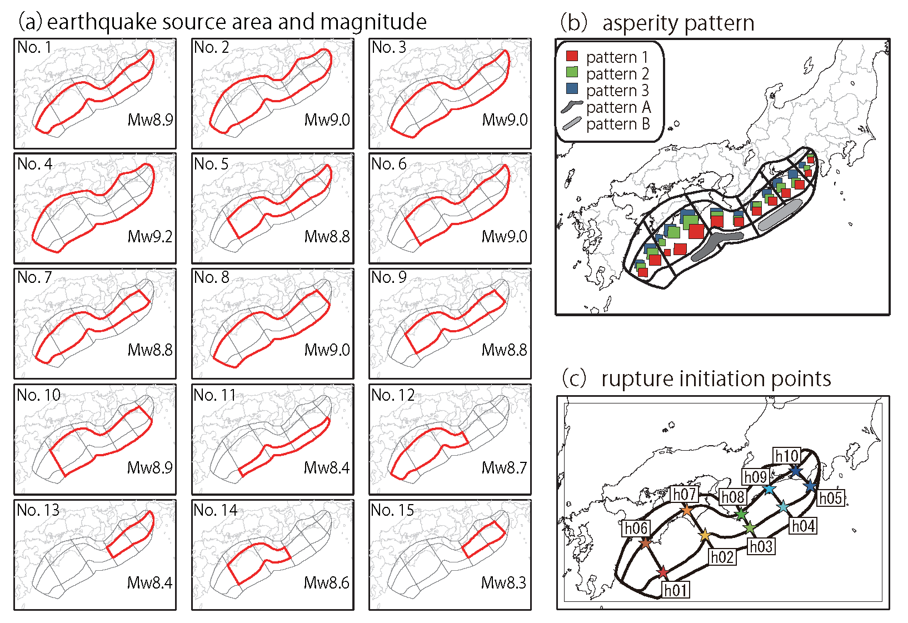
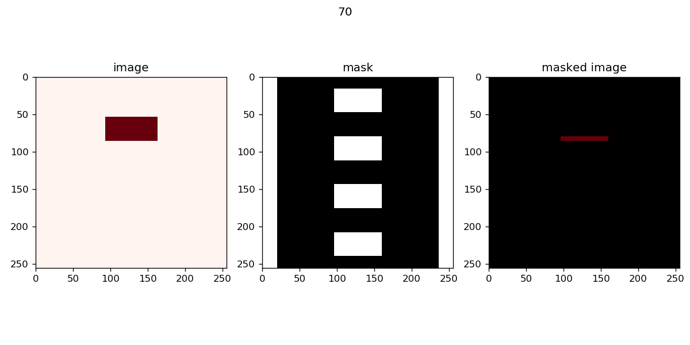
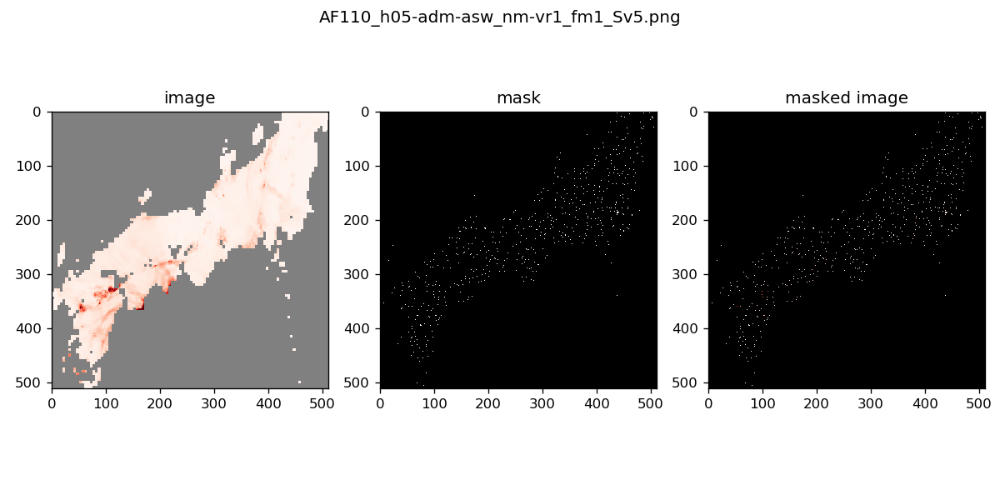
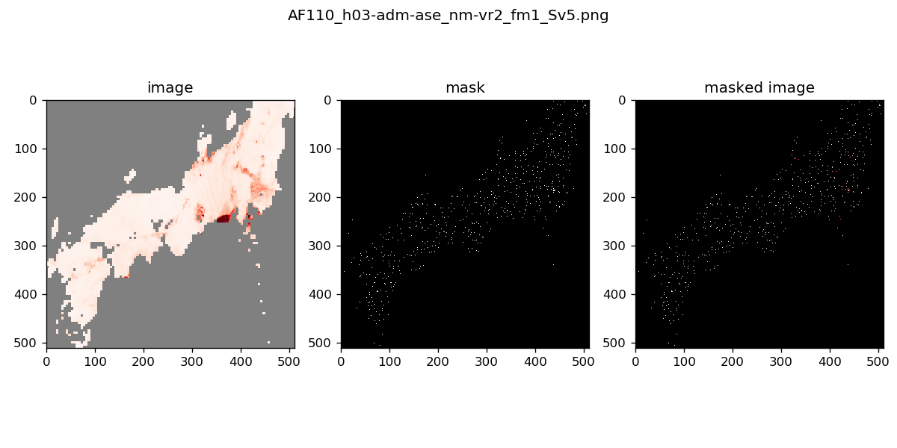

# Position-dependent inpainting

This reposititory provides data and codes used in the paper [Position-Dependent Partial Convolutions for Supervised Spatial Interpolation](https://papers.ssrn.com/sol3/papers.cfm?abstract_id=4311229). 

## Requirement
- Python 3
- Tensorflow 2.x

## Dataset
- Toy dataset  
To reproduce the problem of translation invariance in spatial interpolation, we designed an image of 256 * 256 to contain a rectangular object with different widths depending on its vertical position---narrow in the upper-half and wide in the lower-half, and the fixed mask M to contain several windows of the same width vertically.  
  
- Simulated ground motion datasets
512 * 512 images of ground motion in 360 rupture scenarios for the anticipated megathrust earthquakes in the Nankai trough (Maeda et al. (2016)). 
The ground-motion simulation was performed by a numerical inite-difference computation of seismic wave propagation from the earthquake source to the ground surface in a 3-D medium.  
There are three datasets as follows:
    - All---all 360 scenarios using 10-fold cross-validation
    - East---150 scenarios with east rapture initiation points, h04, h05, h09 and h10 (see Fig.1 (c)) using 5-fold cross-validation
    - West---140 scenarios of west rapture initiation points, h01, h02, h06 and h07 (see Fig.1 (c)) using 5-fold cross-validation
<p align="center">
  
</p>
<p align="center">
Fig. 1 Variability of the possible earthquake rupture parameters for the anticipated megathrust earthquakes in the Nankai trough.
</p>
All datasets (one toy and three for ground motion) consists of train, validation and test.  

### Preparation
- Download all files from [googl drive](https://drive.google.com/drive/folders/1A8SPMM7OBdZfD8x2EeQ3G-pYih4hfINJ) and place them under ./data folder.
- Visualize images and masks in each dataset using the following command:
~~~
python visualize_data.py [-data] [-mode] [-cv] [-start_ind] [-display_num]
~~~

- data
    - String : name of data, \'quake-all\', \'quake-east\', \'quake-west\', or \'toy\' (default=quake-all)
- mode
    - String : name of mode, \'train\', \'test\', or \'valid\' (default=train)'
- cv
    - Int : number of cross validation, 0-9 (default=0)
- start_ind
    - Int : start index (default=0)
- display_num
    - Int : number of images displayed (default=5)

### Examples of visualization
~~~bash
python visualize_data.py -data toy -mode train -start_ind 70 -display_num 1
~~~
<p align="center">
  
</p>

~~~bash
python visualize_data.py -data quake-all -mode train -start_ind 0 -display_num 2
~~~
<p align="center">
  
  
</p>

## Codes of spatial interpolation
comming soon

## Codes of deep inpainting
comming soon

## Citation
```
@inproceedings{acml:hachiya:2022,
  title={Position-dependent partial convolutions for supervised spatial interpolation},
  author={Hirotaka Hachiya, Kotaro Nagayoshi, Asako Iwaki, Takahiro Maeda, Naonori Ueda, Hiroyuki Fujiwara},
  booktitle={Proceedings of the 14th Asian Conference on Machine Learning (ACML)},
  year={2022}
}
